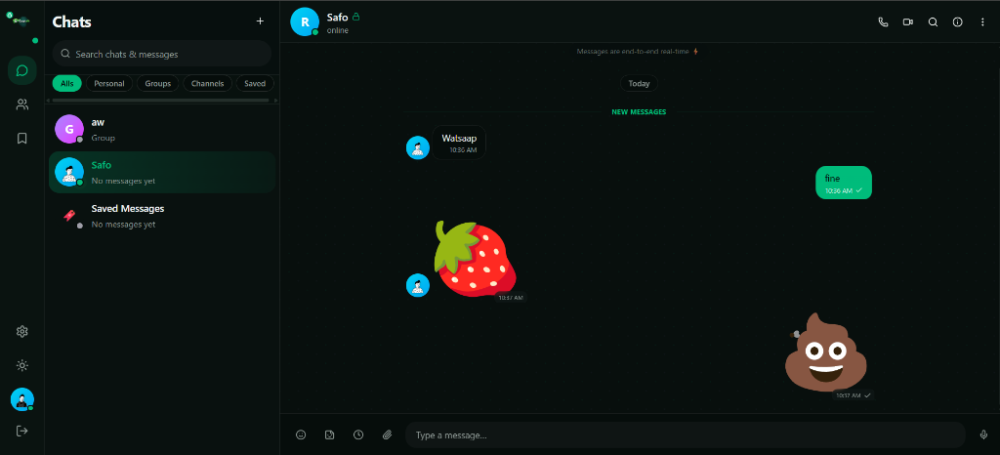
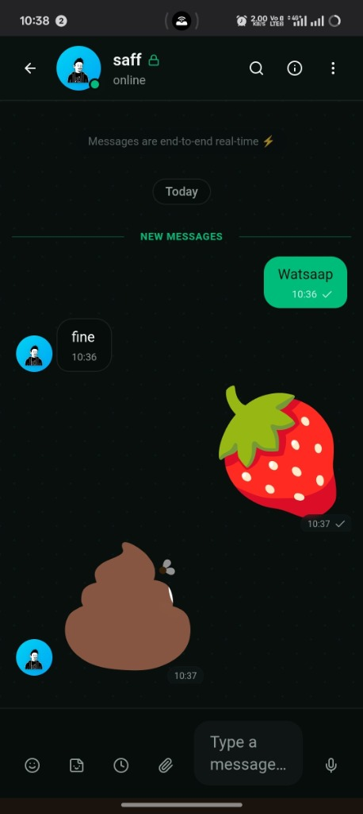

<div align="center">


# Cryptalk

### Private by default. Fast by design.

[](https://python.org)
[](https://fastapi.tiangolo.com)
[](https://nextjs.org)
[](https://flutter.dev)
[](LICENSE)

<br/><br/>

<br/><br/>

</div>

---

## Features

- **End-to-end encryption** — X25519 + ChaCha20-Poly1305. Server is zero-knowledge.
- **Real-time messaging** — instant delivery via WebSockets (Socket.IO)
- **Email authentication** — no phone number required
- **Voice messages** — real recording with Web Audio API, encrypted before send
- **File sharing** — images, docs, voice up to 25MB, E2EE ciphertext stored in Supabase, auto-deleted on delivery
- **Message reactions, replies, edit, delete for everyone**
- **Self-destructing messages** — set expiration timer (10s to 1 week)
- **Delivery states** — ✓ sent, ✓✓ delivered, ✓✓ read (blue)
- **Groups & channels** — with admin controls, kick, promote, transfer ownership
- **Expiring groups** — auto-delete after 1-7 days (perfect for events)
- **Invite links** — shareable token URLs for group joins
- **Connections** — find users by username, send/accept requests
- **Blocking & nicknames** — block users, set custom display names
- **Cross-chat search** — search across all conversations
- **Report system** — report users or content for abuse
- **Account deletion** — permanently wipe all user data
- **Draft messages** — saved per chat, restored on switch
- **Unread divider** — "New Messages" separator line
- **Animated stickers** — Lottie-based animated emoji
- **Custom SVG avatars** — 8 unique geometric patterns
- **Dark/light theme** — 8 accent colors, 5 chat wallpapers
- **Fully responsive** — mobile bottom-nav, desktop three-column
- **Flutter app** — iOS, Android, macOS, Windows, Linux from one codebase

## Architecture

```
┌──────────────────────────────────────────────────────┐
│                    Client (Browser / App)              │
│  Next.js Web · Flutter Mobile · WebSocket · E2EE      │
└────────────────────────┬─────────────────────────────┘
                         │ HTTPS / WSS
                         ▼
┌──────────────────────────────────────────────────────┐
│                     Caddy / Render                      │
│              TLS termination · CORS                    │
└─────────┬─────────────────────────────┬───────────────┘
          │                             │
          ▼ :3000 (Vercel)              ▼ :8001 (Render)
┌──────────────────────┐     ┌──────────────────────────┐
│  Frontend (Next.js)   │     │  Backend (FastAPI+SIO)    │
│  ──────────────────  │     │  ──────────────────────  │
│  • UI components      │     │  • Clean architecture     │
│  • Zustand store      │     │  • API → Service → Repo   │
│  • E2EE client-side   │     │  • Socket.IO realtime     │
│  • Lottie stickers    │     │  • Brute-force lockout    │
└──────────────────────┘     └───────────┬──────────────┘
                                         │
                              ┌──────────┴──────────┐
                              ▼                     ▼
                     ┌──────────────┐    ┌──────────────┐
                     │  SQLite (dev) │    │ Supabase PG  │
                     │  / PostgreSQL │    │  (prod)      │
                     └──────────────┘    └──────────────┘
```

### Backend — Clean Architecture (Python)

```
backend/app/
├── main.py              # ASGI app + middleware + security headers
├── core/                # config, database, security, rate limiting, brute force, cache, storage
├── models/              # SQLAlchemy ORM entities
├── schemas/             # Pydantic DTOs (camelCase + snake_case)
├── repositories/        # Data access layer (batch queries, no N+1)
├── services/            # Business logic + DI
├── api/v1/              # HTTP controllers
│   ├── auth.py          #   email auth + onboarding + brute-force lockout
│   ├── chats.py         #   chat CRUD + settings
│   ├── chat_management.py # leave, delete, kick, invite, search, reports
│   ├── messages.py      #   messages + reactions + delivery + auto-purge
│   ├── social.py        #   connections, blocks, nicknames
│   ├── e2ee.py          #   public key distribution
│   ├── uploads.py       #   E2EE file upload + quota + storage
│   └── users.py         #   profile + search
└── realtime/            # Socket.IO (cookie-auth at connect time)
```

### Frontend — Feature-Modular (Next.js)

```
frontend/src/
├── app/                 # Next.js App Router
├── components/chat/     # All chat UI components
├── hooks/               # use-socket, use-mobile
├── stores/              # Zustand global state
└── lib/                 # api client, E2EE, icons, cache, types
```

### Flutter — Cross-Platform

```
flutter/lib/
├── main.dart            # App entry + Supabase init
├── app_router.dart      # Auth gate
├── core/                # api, auth, chat, crypto, socket, supabase
└── features/            # auth, chat screens
```

## Quick Start

### Backend

```bash
cd backend
pip install -r requirements.txt
cp .env.example .env  # set SESSION_SECRET
uvicorn app.main:asgi_app --host 0.0.0.0 --port 8001 --reload
```

### Frontend (Web)

```bash
cd frontend
bun install
cp .env.example .env.local
bun run dev
```

### Flutter (Mobile/Desktop)

```bash
cd flutter
flutter pub get
cp .env.example .env  # set BACKEND_URL
flutter run
```

### Supabase (Production Database)

1. Create a project at [supabase.com](https://supabase.com)
2. Run `supabase/schema.sql` in the SQL Editor
3. Set `DATABASE_URL` in your backend env to the Supabase connection string

See [`supabase/README.md`](supabase/README.md) for detailed setup.

## Deployment

### Backend → Render

1. Push this repo to GitHub
2. Go to [render.com](https://render.com) → New → Blueprint
3. Select this repo — Render reads `render.yaml` automatically
4. Set the secret env vars when prompted:
   - `SESSION_SECRET` — `openssl rand -hex 32`
   - `DATABASE_URL` — your Supabase Postgres connection string
   - `CORS_ORIGINS` — your Vercel frontend URL (e.g. `https://cryptalk.vercel.app`)
   - `REDIS_URL` — optional, Upstash Redis for multi-instance Socket.IO
   - `SUPABASE_URL` / `SUPABASE_KEY` — for file storage
5. Deploy — Render runs `pip install -r requirements.txt` in `backend/` and starts `uvicorn` on `$PORT`

### Frontend → Vercel

1. Go to [vercel.com](https://vercel.com) → New Project → import this repo
2. **Set Root Directory to `frontend`** (critical — this is a monorepo)
3. Vercel auto-detects Next.js and reads `frontend/vercel.json`
4. Set env vars in Vercel dashboard → Settings → Environment Variables:
   - `NEXT_PUBLIC_BACKEND_URL` — your Render backend URL (e.g. `https://cryptalk-backend.onrender.com`)
5. Deploy — Vercel runs `bun install` + `next build` automatically

### Flutter APK → GitHub Actions

Push a `v*` tag to trigger the build workflow:
```bash
git tag v1.0.0
git push origin v1.0.0
```
The APK is uploaded as a GitHub Release artifact.

## Security

| Feature | Implementation |
|---|---|
| Password hashing | scrypt (N=16384, r=8, p=1) |
| Session tokens | HMAC-SHA256 signed cookies (HTTP-only, Secure, SameSite=Lax) |
| Rate limiting | Per-user + per-IP (10 logins/min, 120 API/min) |
| Brute-force lockout | 5 failed logins → 15-min account lock |
| Socket auth | Cookie-verified at connection time (no self-declared userId) |
| Input validation | Pydantic + regex on all inputs |
| Content sanitization | HTML escaping, control char stripping, length limits |
| E2EE | X25519 + ChaCha20-Poly1305 (zero-knowledge server) |
| Ephemeral storage | Content + Supabase blob wiped after delivery |
| SQL injection | SQLAlchemy parameterized queries |
| Path traversal | Rejected on upload paths (`..`, null bytes) |
| Security headers | X-Frame-Options, HSTS, X-Content-Type-Options, Referrer-Policy |
| Row Level Security | Supabase RLS policies on all tables |
| File sharing | 25MB/file, 950MB total quota, E2EE ciphertext, auto-deleted |

## Project Structure

```
Cryptalk/
├── backend/              # Python FastAPI backend
├── frontend/             # Next.js web client
├── flutter/              # Flutter mobile/desktop client
├── supabase/             # PostgreSQL schema + setup guide
├── prisma/               # Shared schema (for seeding)
├── scripts/              # Database seed script
├── .github/workflows/    # CI + Flutter APK build
├── CONTRIBUTING.md
└── LICENSE
```

## Documentation

- [Backend README](backend/README.md) — API reference, endpoints
- [Frontend README](frontend/README.md) — Components, features
- [Flutter README](flutter/README.md) — Mobile app setup
- [Supabase Setup](supabase/README.md) — Database configuration
- **Swagger UI** — `http://localhost:8001/docs`

## Contributing

See [CONTRIBUTING.md](CONTRIBUTING.md). PRs welcome.

## License

MIT — see [LICENSE](LICENSE).
